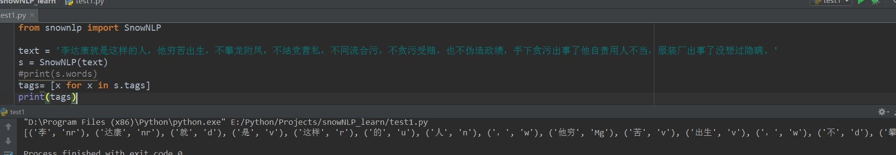
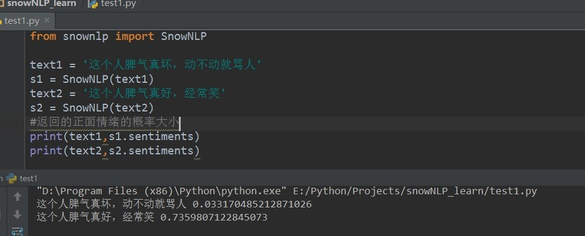
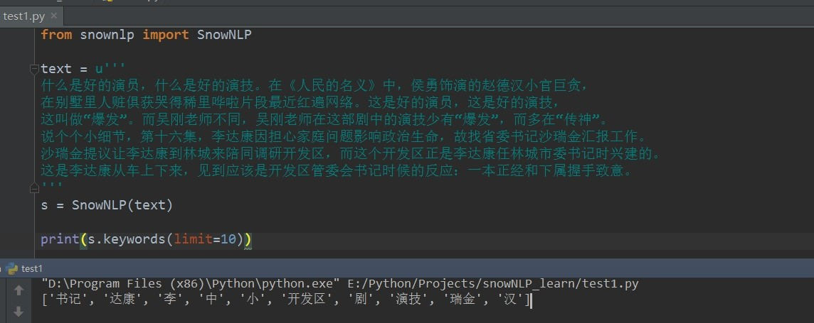

# SnowNLP工具包

## 1：下载地址
### https://github.com/isnowfy/snownlp

## 2：工具简介

#### SnowNLP是一个python写的类库，可以方便的处理中文文本内容，是受到了TextBlob的启发而写的，由于现在大部分的自然语言处理库基本都是针对英文的，于是写了一个方便处理中文的类库，并且和TextBlob不同的是，这里没有用NLTK，所有的算法都是自己实现的，并且自带了一些训练好的字典。注意本程序都是处理的unicode编码，所以使用时请自行decode成unicode。

### 关于功能：

•	中文分词（Character-Based Generative Model）

•	词性标注（TnT 3-gram 隐马）

•	情感分析（现在训练数据主要是买卖东西时的评价，所以对其他的一些可能效果不是很好，待解决）

•	文本分类（Naive Bayes）

•	转换成拼音（Trie树实现的最大匹配）

•	繁体转简体（Trie树实现的最大匹配）

•	提取文本关键词（TextRank算法）

•	提取文本摘要（TextRank算法）

•	tf，idf

•	Tokenization（分割成句子）

•	文本相似（BM25）

•	支持python3（感谢erning）

### 关于训练：

现在提供训练的包括分词，词性标注，情感分析，而且都提供了我用来训练的原始文件 以分词为例 分词在snownlp/seg目录下

from snownlp import seg

seg.train('data.txt')

seg.save('seg.marshal')

#from snownlp import tag
#tag.train('199801.txt')
#tag.save('tag.marshal')
#from snownlp import sentiment
#sentiment.train('neg.txt', 'pos.txt')
#sentiment.save('sentiment.marshal')

这样训练好的文件就存储为seg.marshal了，之后修改snownlp/seg/__init__.py里的data_path指向刚训练好的文件即可

## 2：使用教程

### 1：编译和安装
####  方法一：
将github上的安装文件下载到服务器，运行python setup.py进行安装
#### 方法二：
在命令窗口cmd下面运行pip install snownlp

### 2：使用方法
#### 1：分词
首先import SnowNLP 将句子放入SnowNLP；输出s.words,例子代码

#### 2：词性标注
首先import SnowNLP 将句子放入SnowNLP；输出s.tags,例子代码

#### 3：情绪判断
返回值为正面情绪的概率，
越接近1表示正面情绪
越接近0表示负面情绪

#### 4：关键词抽取

## 3：相关论文
欧阳效福. 基于游客微博“大数据”分析的厦门旅游环境意象研究[D]. 厦门大学, 2016.
